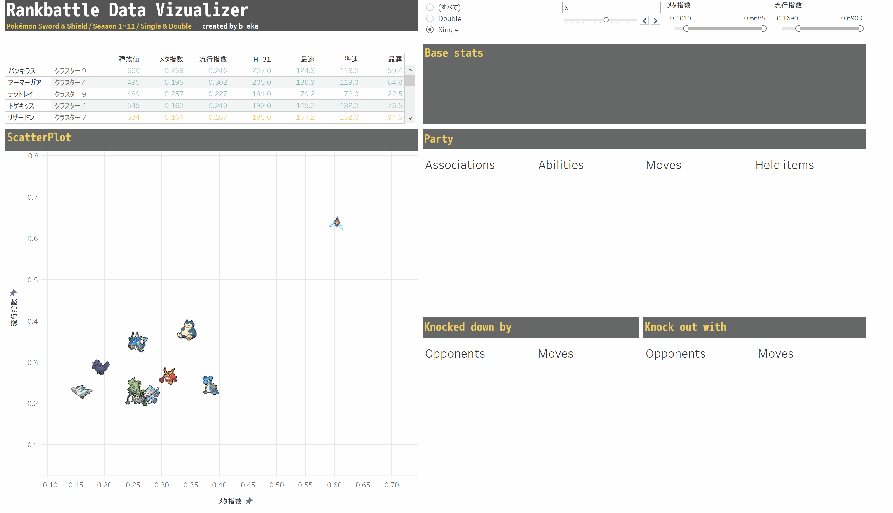

# Pokemon Rankbattle Data Transformer


## 概要 / Overview

ポケモン剣盾のランクバトルの集計データをウェブ上から取得し、表示しやすいように整形するプログラムです。

詳細については[こちら](https://qiita.com/b_aka/items/7d2b768dfa7817f34fc2)の記事をお読みください。

This is a program that retrieves the aggregate data of Pokémon sword and shield ranked battles from the web and formats it for easy display.

## 使い方 / Usage

**0. Python(version >= 3.7)が入っていない場合、**

**If you don't install Python (version >= 3.7), you will use**

```bash
$ sudo apt-get install python3.7
```

もしくは、[Python.org](https://www.python.org/)から落としてインストールしてください。また`pip`のpathが通っている状態にしてください。

Or, you will download python from [Python.org](https://www.python.org/) and install it. Make sure your pip path is running.

**1. プログラムの動作に必要となるパッケージをインストールします。**

**Install the packages that you need to run the program.**

```bash
$ pip install -r requirements.txt
```

`requirements.txt`に記載されているファイルは以下の通りです。バージョンは問いませんので、既にインストールされている場合はスキップしてください。

The files listed in `requirements.txt` are as follows. It does not matter what version you have, if you have already installed it, skip it.

```bash
###### Requirements without Version Specifiers ######
pandas
scikit-learn
tqdm
urllib3
```

**2. 以下を実行して整形されたcsvファイルを`resources`と`output`に出力します**

**Running**

```bash
$ python main.py [-d Boolean]
```

コマンドライン引数`-d`に`False`を指定すると、ファイルのダウンロードを行わないようにできます。デフォルトで`True`となっていいるのでダウンロードを行いたくない場合のみ指定してください。

If the command line argument `-d` is set to `False`, you can disable the download of the file. It is set to `True` by default, so specify it only if you do not want to download the file.

## 出力されたファイルの利用法 / How to use the output file



[ポケモン剣盾のランクバトルデータを解析してTableau上で可視化してみた - Qiita](https://qiita.com/b_aka/items/7d2b768dfa7817f34fc2) をご覧ください。

Please refer to [Pokémon Sword Shield Ranked Battle Data Analyzed and Visualized on Tableau - Qiita](https://qiita.com/b_aka/items/7d2b768dfa7817f34fc2).


## License

MIT

--------

moxak Github [@moxak](https://github.com/moxak) Twitter [@moxak_](https://twitter.com/moxak_)

